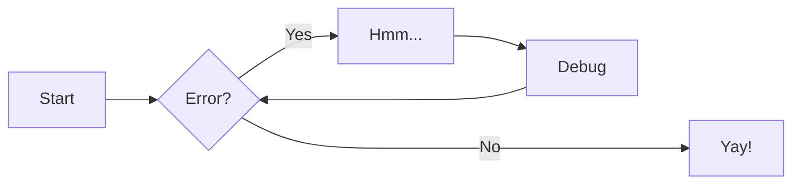
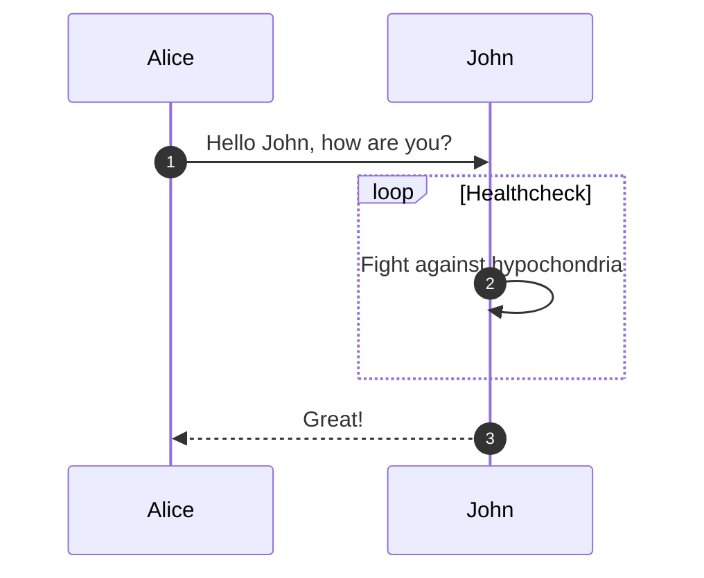
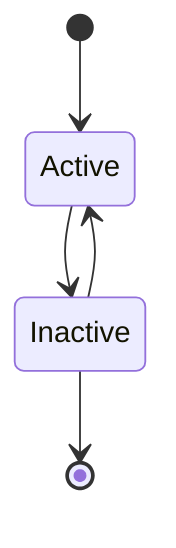
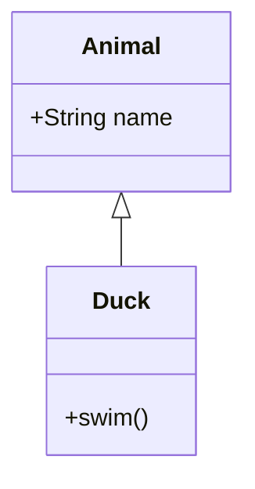
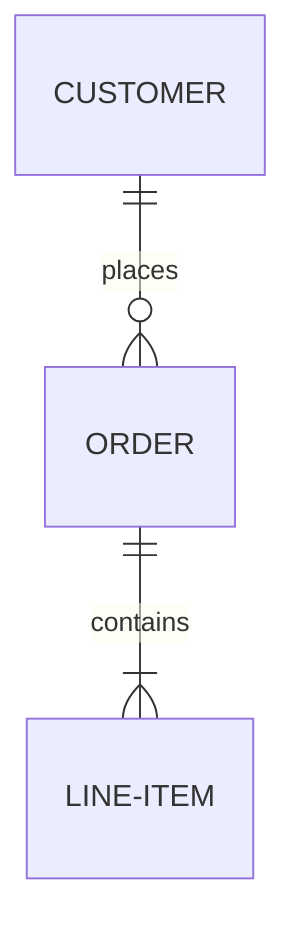

# Zensical Content Authoring

Reference for all authoring features available in Zensical documentation sites.
Covers admonitions, code blocks, content tabs, diagrams, grids, icons, math,
tables, formatting, front matter, and more.

All examples use the recommended default Markdown extensions configuration.
If extensions have been customized, some features may require explicit enabling.

## Front Matter

Every page can include YAML front matter for metadata and behavior control:

```yaml
---
title: Custom Page Title              # Override nav/head title
description: Page meta description    # HTML meta tag
icon: lucide/braces                   # Navigation icon
status: new                           # Page status badge (new, deprecated)
template: my_template.html            # Custom template
tags:
  - Setup
  - Getting started
hide:
  - navigation                        # Hide left sidebar
  - toc                               # Hide right sidebar
  - path                              # Hide breadcrumbs
  - footer                            # Hide prev/next links
  - tags                              # Hide tag chips
  - feedback                          # Hide feedback widget
search:
  exclude: true                       # Exclude from search
comments: true                        # Enable comments (if configured)
---
```

Custom page status identifiers (in `zensical.toml`):
```toml
[project.extra.status]
new = "Recently added"
deprecated = "Deprecated"
```

## Admonitions (Call-outs)

**Required extensions:** `admonition`, `pymdownx.details`, `pymdownx.superfences`

### Basic

```markdown
!!! note

    Content indented by 4 spaces.
```

### With Custom Title

```markdown
!!! note "My Custom Title"

    Content here.
```

### Without Title

```markdown
!!! note ""

    No title or icon shown.
```

### Collapsible (closed by default)

```markdown
??? note

    Click to expand.
```

### Collapsible (open by default)

```markdown
???+ note

    Initially expanded, can be collapsed.
```

### Nested

```markdown
!!! note "Outer"

    Outer content.

    !!! warning "Inner"

        Inner content (indented further).
```

### Inline (sidebar placement)

```markdown
!!! info inline end "Right sidebar"

    Placed to the right of following content.

!!! info inline "Left sidebar"

    Placed to the left of following content.
```

**Important:** Inline admonitions must appear _before_ the content they sit beside.

### Supported Types

`note`, `abstract`, `info`, `tip`, `success`, `question`, `warning`,
`failure`, `danger`, `bug`, `example`, `quote`

Custom icons per type:
```toml
[project.theme.icon.admonition]
note = "octicons/tag-16"
tip = "octicons/squirrel-16"
```

## Code Blocks

**Required extensions:** `pymdownx.highlight`, `pymdownx.inlinehilite`,
`pymdownx.snippets`, `pymdownx.superfences`

### Basic with Syntax Highlighting

````markdown
``` python
def hello():
    print("Hello, world!")
```
````

### With Title

````markdown
``` python title="hello.py"
def hello():
    print("Hello, world!")
```
````

### With Line Numbers

````markdown
``` python linenums="1"
def hello():
    print("Hello, world!")
```
````

### Highlight Specific Lines

````markdown
``` python hl_lines="2 3"
def bubble_sort(items):
    for i in range(len(items)):
        for j in range(len(items) - 1 - i):
            if items[j] > items[j + 1]:
                items[j], items[j + 1] = items[j + 1], items[j]
```
````

Line ranges: `hl_lines="3-5"`

### Code Annotations

Add numbered markers in comments that expand to rich content:

````markdown
``` toml
[project.theme]
features = ["content.code.annotate"] # (1)!
```

1.  I'm a code annotation! Supports **Markdown**, `code`, images, etc.
````

The `!` after `(1)` strips the comment characters. Enable globally:
```toml
[project.theme]
features = ["content.code.annotate"]
```

Or per-block with `{ .yaml .annotate }` syntax.

### Code Copy/Select Buttons

```toml
[project.theme]
features = [
  "content.code.copy",    # Copy button on code blocks
  "content.code.select"   # Line selection button
]
```

Per-block: `{ .yaml .copy }`, `{ .yaml .no-copy }`, `{ .yaml .select }`, `{ .yaml .no-select }`

### Inline Syntax Highlighting

```markdown
The `#!python range()` function generates a sequence of numbers.
```

### Embed External Files

````markdown
``` title=".browserslistrc"
;--8<-- ".browserslistrc"
```
````

### Custom Syntax Theme Colors

Override via CSS variables:
```css
:root > * {
  --md-code-hl-string-color: #0FF1CE;
  --md-code-fg-color: ...;
  --md-code-bg-color: ...;
  --md-code-hl-color: ...;
}
```

## Content Tabs

**Required extensions:** `pymdownx.superfences`, `pymdownx.tabbed` (with `alternate_style = true`)

### Basic Tabs

```markdown
=== "Tab 1"

    Content for tab 1.

=== "Tab 2"

    Content for tab 2.
```

### Code Block Tabs

````markdown
=== "Python"

    ``` python
    print("Hello")
    ```

=== "JavaScript"

    ``` javascript
    console.log("Hello");
    ```
````

### Linked Content Tabs (sync across page)

```toml
[project.theme]
features = ["content.tabs.link"]
```

### Tabs Inside Admonitions

````markdown
!!! example

    === "Tab A"

        Content A.

    === "Tab B"

        Content B.
````

### Anchor Links / Slugification

```toml
[project.markdown_extensions.pymdownx.tabbed.slugify]
object = "pymdownx.slugs.slugify"
kwds = { case = "lower" }
```

## Diagrams (Mermaid.js)

**Required:** `pymdownx.superfences` with custom fence:

```toml
[project.markdown_extensions.pymdownx.superfences]
custom_fences = [
  { name = "mermaid", class = "mermaid", format = "pymdownx.superfences.fence_code_format" }
]
```

### Flowchart

````markdown

````

### Sequence Diagram

````markdown

````

### State Diagram

````markdown

````

### Class Diagram

````markdown

````

### Entity-Relationship Diagram

````markdown

````

Diagrams auto-adapt to light/dark themes and use configured fonts.

## Data Tables

**Required extension:** `tables`

```markdown
| Method   | Description              |
| -------- | ------------------------ |
| `GET`    | :lucide-check: Fetch     |
| `PUT`    | :lucide-check: Update    |
| `DELETE` | :lucide-x: Delete        |
```

Alignment: `:---` (left), `:---:` (center), `---:` (right)

### Sortable Tables

Add tablesort JS:
```javascript
// docs/javascripts/tablesort.js
document$.subscribe(function() {
  var tables = document.querySelectorAll("article table:not([class])")
  tables.forEach(function(table) {
    new Tablesort(table)
  })
})
```

```toml
[project]
extra_javascript = [
  "https://unpkg.com/tablesort@5.3.0/dist/tablesort.min.js",
  "javascripts/tablesort.js"
]
```

## Grids

**Required extensions:** `attr_list`, `md_in_html`

### Card Grid (list syntax)

```html
<div class="grid cards" markdown>

- :fontawesome-brands-html5: __HTML__ for content and structure
- :fontawesome-brands-js: __JavaScript__ for interactivity
- :fontawesome-brands-css3: __CSS__ for styling

</div>
```

### Complex Card Grid

```html
<div class="grid cards" markdown>

-   :material-clock-fast:{ .lg .middle } __Set up in 5 minutes__

    ---

    Install Zensical and get up and running in minutes.

    [:octicons-arrow-right-24: Getting started](#)

-   :fontawesome-brands-markdown:{ .lg .middle } __It's just Markdown__

    ---

    Focus on your content and generate a responsive site.

    [:octicons-arrow-right-24: Reference](#)

</div>
```

### Block Syntax (mix cards with other elements)

```html
<div class="grid" markdown>

:fontawesome-brands-html5: __HTML__
{ .card }

:fontawesome-brands-js: __JavaScript__
{ .card }

> A regular blockquote (not a card)

</div>
```

### Generic Grids (any block elements side by side)

````html
<div class="grid" markdown>

=== "Tab A"
    * Item 1
    * Item 2

``` python
print("Hello")
```

</div>
````

## Icons & Emojis

**Required extensions:** `attr_list`, `pymdownx.emoji`

### Emojis

```markdown
:smile: :heart: :thumbsup:
```

### Icons

Icon syntax: `:icon-set-icon-name:` (replace `/` with `-` from path)

```markdown
:fontawesome-regular-face-laugh-wink:
:lucide-check:
:material-material-design:
:octicons-mark-github-16:
:simple-simpleicons:
```

### Icons with Color

```markdown
:fontawesome-brands-youtube:{ .youtube }
```

```css
/* docs/stylesheets/extra.css */
.youtube { color: #EE0F0F; }
```

### Icons with Animation

```markdown
:octicons-heart-fill-24:{ .heart }
```

```css
@keyframes heart {
  0%, 40%, 80%, 100% { transform: scale(1); }
  20%, 60% { transform: scale(1.15); }
}
.heart { animation: heart 1000ms infinite; }
```

### Bundled Icon Sets

Lucide, Material Design, FontAwesome, Octicons, Simple Icons (10,000+)

## Buttons

**Required extension:** `attr_list`

```markdown
[Subscribe](#){ .md-button }
[Subscribe](#){ .md-button .md-button--primary }
[Send :fontawesome-solid-paper-plane:](#){ .md-button }
```

## Images

**Required extensions:** `attr_list`, `md_in_html`, `pymdownx.blocks.caption`

### Alignment

```markdown
{ align=left }
{ align=right }
```

### Caption (HTML)

```html
<figure markdown="span">
  { width="300" }
  <figcaption>Caption text</figcaption>
</figure>
```

### Caption (Markdown extension)

```markdown
{ width="300" }
/// caption
Caption text
///
```

### Lazy Loading

```markdown
{ loading=lazy }
```

### Light / Dark Mode

```markdown


```

## Lists

### Definition Lists

**Required extension:** `def_list`

```markdown
`Term`

:   Definition paragraph. Can contain multiple paragraphs
    indented by 4 spaces.
```

### Task Lists

**Required extension:** `pymdownx.tasklist` (with `custom_checkbox = true`)

```markdown
- [x] Completed task
- [ ] Incomplete task
    * [x] Nested completed
    * [ ] Nested incomplete
```

## Formatting

**Required extensions:** `pymdownx.caret`, `pymdownx.keys`, `pymdownx.mark`, `pymdownx.tilde`

```markdown
==Highlighted text==
^^Underlined text^^
~~Strikethrough text~~

H~2~O (subscript)
A^T^A (superscript)

++ctrl+alt+del++ (keyboard keys)
```

## Footnotes

**Required extension:** `footnotes`

```markdown
Text with footnote reference.[^1]

[^1]: Footnote content. Can span multiple indented paragraphs.
```

Enable tooltips:
```toml
[project.theme]
features = ["content.footnote.tooltips"]
```

## Tooltips & Abbreviations

**Required extensions:** `abbr`, `attr_list`, `pymdownx.snippets`

### Link Tooltips

```markdown
[Hover me](https://example.com "I'm a tooltip!")
```

### Abbreviations

```markdown
The HTML specification is maintained by the W3C.

*[HTML]: Hyper Text Markup Language
*[W3C]: World Wide Web Consortium
```

### Global Glossary

Create `includes/abbreviations.md` with all abbreviations, then:
```toml
[project.markdown_extensions.pymdownx.snippets]
auto_append = ["includes/abbreviations.md"]
```

Enable improved tooltips:
```toml
[project.theme]
features = ["content.tooltips"]
```

## Math (LaTeX)

**Required extension:** `pymdownx.arithmatex` (with `generic = true`)

### MathJax Setup

```toml
[project]
extra_javascript = [
  "javascripts/mathjax.js",
  "https://unpkg.com/mathjax@3/es5/tex-mml-chtml.js"
]
[project.markdown_extensions.pymdownx.arithmatex]
generic = true
```

```javascript
// docs/javascripts/mathjax.js
window.MathJax = {
  tex: {
    inlineMath: [["\\(", "\\)"]],
    displayMath: [["\\[", "\\]"]],
    processEscapes: true,
    processEnvironments: true
  },
  options: {
    ignoreHtmlClass: ".*|",
    processHtmlClass: "arithmatex"
  }
};
document$.subscribe(() => {
  MathJax.startup.output.clearCache()
  MathJax.typesetClear()
  MathJax.texReset()
  MathJax.typesetPromise()
})
```

### KaTeX Setup (lighter alternative)

```toml
[project]
extra_javascript = [
  "javascripts/katex.js",
  "https://unpkg.com/katex@0/dist/katex.min.js",
  "https://unpkg.com/katex@0/dist/contrib/auto-render.min.js"
]
extra_css = ["https://unpkg.com/katex@0/dist/katex.min.css"]
[project.markdown_extensions.pymdownx.arithmatex]
generic = true
```

### Usage

Block math:
```markdown
$$
\cos x = \sum_{k=0}^{\infty}\frac{(-1)^k}{(2k)!}x^{2k}
$$
```

Inline math:
```markdown
The function $f(x) = x^2$ is quadratic.
```

## Search Exclusion

### Exclude Page

```yaml
---
search:
  exclude: true
---
```

### Exclude Section

```markdown
## Secret Section { data-search-exclude }

This content won't appear in search.
```

### Exclude Block

```markdown
This paragraph is excluded from search.
{ data-search-exclude }
```

## Configuration Quick Reference

### Content Features (theme features)

```toml
[project.theme]
features = [
  "content.code.annotate",       # Code annotations
  "content.code.copy",           # Copy button
  "content.code.select",         # Line selection
  "content.tabs.link",           # Linked content tabs
  "content.tooltips",            # Improved tooltips
  "content.footnote.tooltips",   # Footnote tooltips
]
```

### Recommended zensical.toml Starter

For a fully-featured documentation site:

```toml
[project]
site_name = "My Project"
site_url = "https://example.com"
repo_url = "https://github.com/org/repo"

[project.theme]
features = [
  "navigation.instant",
  "navigation.tabs",
  "navigation.sections",
  "navigation.path",
  "navigation.top",
  "navigation.footer",
  "navigation.indexes",
  "toc.follow",
  "search.highlight",
  "content.code.annotate",
  "content.code.copy",
  "content.tabs.link",
  "content.tooltips",
  "content.footnote.tooltips",
  "content.action.edit",
  "content.action.view",
  "header.autohide",
]

[[project.theme.palette]]
scheme = "default"
toggle.icon = "lucide/sun"
toggle.name = "Switch to dark mode"

[[project.theme.palette]]
scheme = "slate"
toggle.icon = "lucide/moon"
toggle.name = "Switch to light mode"
```