# RA-MCP Architecture Diagrams

This document contains comprehensive Mermaid diagrams to visualize the ra-mcp codebase architecture, data flows, and component relationships.

## 1. Architecture Overview

This diagram shows the complete system from user interactions through to external APIs, highlighting the FastMCP composition pattern and clean separation of concerns.


## 2. Module Structure

This diagram displays the physical organization of the codebase with clear module boundaries and dependencies.

```mermaid
graph TB
    subgraph "src/ra_mcp/"
        ROOT[🏠 __init__.py<br/>config.py<br/>models.py<br/>server.py<br/>search_tools.py<br/>hf_tools.py]

        subgraph "cli/"
            CLI_MAIN[main.py]
            CLI_COMMANDS[commands.py]
            CLI_HARVESTER[oai_pmh_harvester.py]
        end

        subgraph "services/"
            SERVICES[📋 Services:<br/>• search_operations.py<br/>• display_service.py<br/>• search_enrichment_service.py<br/>• page_context_service.py<br/>• analysis.py]
        end

        subgraph "clients/"
            CLIENTS[🔗 API Clients:<br/>• search_client.py<br/>• iiif_client.py<br/>• alto_client.py<br/>• oai_pmh_client.py]
        end

        subgraph "formatters/"
            FORMATTERS[🎨 Formatters:<br/>• base_formatter.py<br/>• mcp_formatter.py<br/>• rich_formatter.py]
        end

        subgraph "utils/"
            UTILS[🛠️ Utilities:<br/>• http_client.py<br/>• page_utils.py<br/>• url_generator.py]
        end
    end

    %% Dependencies
    ROOT --> SERVICES
    ROOT --> CLIENTS
    ROOT --> FORMATTERS
    ROOT --> UTILS

    CLI_MAIN --> SERVICES
    CLI_COMMANDS --> SERVICES
    CLI_HARVESTER --> CLIENTS

    SERVICES --> CLIENTS
    SERVICES --> FORMATTERS
    SERVICES --> UTILS

    CLIENTS --> UTILS

    classDef rootClass fill:#e3f2fd
    classDef moduleClass fill:#f1f8e9
    classDef dependencyClass fill:#fff3e0

    class ROOT rootClass
    class SERVICES,CLIENTS,FORMATTERS,UTILS,CLI_MAIN,CLI_COMMANDS,CLI_HARVESTER moduleClass
```



## 3. Data Flow for Search Operations

This sequence diagram illustrates how requests flow through the system for the three main operations (search, browse, get structure), showing the sequence of calls and data transformations.

```mermaid
sequenceDiagram
    participant User as 👤 User/AI
    participant MCP as 🔍 search_tools.py
    participant SearchOps as ⚙️ SearchOperations
    participant SearchClient as 🔗 SearchClient
    participant API as 🏛️ Riksarkivet API
    participant Enrichment as ✨ EnrichmentService
    participant IIIF as 🖼️ IIIF Client
    participant Display as 🎨 DisplayService
    participant Formatter as 🎭 MCPFormatter

    Note over User,Formatter: Search Transcribed Documents Flow

    User->>+MCP: search_transcribed(keyword, offset)
    MCP->>+SearchOps: search_transcribed(params)

    SearchOps->>+SearchClient: search_transcribed_text(keyword, max_results, offset)
    SearchClient->>+API: GET /api/records?search=keyword&offset=...
    API-->>-SearchClient: JSON response with hits
    SearchClient-->>-SearchOps: List[SearchHit] + total_count

    alt if enrichment enabled
        SearchOps->>+Enrichment: enrich_search_hits(hits)
        Enrichment->>+IIIF: get_iiif_info(reference_codes)
        IIIF-->>-Enrichment: IIIF manifest data
        Enrichment-->>-SearchOps: enriched hits with IIIF links
    end

    SearchOps->>+Display: format_search_results(hits, params)
    Display->>+Formatter: format_search_response(data)
    Formatter-->>-Display: formatted response
    Display-->>-SearchOps: formatted results

    SearchOps-->>-MCP: SearchOperation result
    MCP-->>-User: Formatted search results

    Note over User,Formatter: Browse Document Flow

    User->>+MCP: browse_document(reference_code, pages)
    MCP->>+SearchOps: browse_document(params)

    SearchOps->>+SearchClient: get_document_pages(reference_code, page_list)

    loop for each page
        SearchClient->>+API: GET /api/records/{ref}/pages/{page}
        API-->>-SearchClient: Page transcription data
    end

    SearchClient-->>-SearchOps: List[DocumentPage]

    SearchOps->>+Display: format_document_pages(pages, highlight_term)
    Display->>+Formatter: format_browse_response(pages)
    Formatter-->>-Display: formatted pages
    Display-->>-SearchOps: formatted results

    SearchOps-->>-MCP: BrowseOperation result
    MCP-->>-User: Formatted document pages

    Note over User,Formatter: Get Document Structure Flow

    User->>+MCP: get_document_structure(reference_code)
    MCP->>+SearchOps: get_document_structure(params)

    SearchOps->>+IIIF: get_manifest(reference_code)
    IIIF->>+API: GET IIIF manifest URL
    API-->>-IIIF: IIIF manifest JSON
    IIIF-->>-SearchOps: DocumentStructure

    SearchOps->>+Display: format_document_structure(structure)
    Display->>+Formatter: format_structure_response(structure)
    Formatter-->>-Display: formatted structure
    Display-->>-SearchOps: formatted results

    SearchOps-->>-MCP: DocumentStructure result
    MCP-->>-User: Document structure info
```



## 4. MCP Tool Interaction Diagram

This diagram details the FastMCP server composition and the specific tools, resources, parameters, and responses available to MCP clients.

```mermaid
graph TD
    subgraph "FastMCP Server Composition"
        MAIN[📡 main_server<br/>riksarkivet-mcp]
        SEARCH_SERVER[🔍 search_mcp<br/>ra-search-mcp]
    end

    subgraph "MCP Tools"
        TOOL1[🔍 search_transcribed<br/>Search for keywords in<br/>transcribed materials]
        TOOL2[📖 browse_document<br/>Browse specific pages<br/>by reference code]
        TOOL3[📚 get_document_structure<br/>Get document structure<br/>without content]
    end

    subgraph "MCP Resources"
        RES1[📑 riksarkivet://contents/table_of_contents<br/>Get table of contents]
        RES2[📄 riksarkivet://guide/{filename}<br/>Load specific guide sections]
    end

    subgraph "Tool Parameters & Responses"
        subgraph "search_transcribed"
            PARAMS1[📥 Parameters:<br/>• keyword: str<br/>• offset: int = 0<br/>• max_results: int = 50<br/>• show_context: bool = False]
            RESP1[📤 Response:<br/>SearchOperation with:<br/>• hits: List[SearchHit]<br/>• total_count: int<br/>• pagination info]
        end

        subgraph "browse_document"
            PARAMS2[📥 Parameters:<br/>• reference_code: str<br/>• pages: str<br/>• highlight_term: Optional[str]<br/>• max_pages: int = 10]
            RESP2[📤 Response:<br/>BrowseOperation with:<br/>• pages: List[DocumentPage]<br/>• reference_code: str<br/>• total_pages: int]
        end

        subgraph "get_document_structure"
            PARAMS3[📥 Parameters:<br/>• reference_code: str<br/>• include_manifest_info: bool = True]
            RESP3[📤 Response:<br/>DocumentStructure with:<br/>• metadata: dict<br/>• manifests: List[IIIFManifest]<br/>• total_pages: int]
        end
    end

    %% Server composition
    MAIN -.->|imports| SEARCH_SERVER

    %% Tools belonging to search server
    SEARCH_SERVER --> TOOL1
    SEARCH_SERVER --> TOOL2
    SEARCH_SERVER --> TOOL3

    %% Resources belonging to search server
    SEARCH_SERVER --> RES1
    SEARCH_SERVER --> RES2

    %% Tool parameters and responses
    TOOL1 -.-> PARAMS1
    TOOL1 -.-> RESP1
    TOOL2 -.-> PARAMS2
    TOOL2 -.-> RESP2
    TOOL3 -.-> PARAMS3
    TOOL3 -.-> RESP3

    classDef serverClass fill:#e3f2fd
    classDef toolClass fill:#e8f5e8
    classDef resourceClass fill:#fff3e0
    classDef paramClass fill:#f1f8e9
    classDef responseClass fill:#fce4ec

    class MAIN,SEARCH_SERVER serverClass
    class TOOL1,TOOL2,TOOL3 toolClass
    class RES1,RES2 resourceClass
    class PARAMS1,PARAMS2,PARAMS3 paramClass
    class RESP1,RESP2,RESP3 responseClass
```

## 5. Component Dependencies

This diagram maps the dependency relationships between all modules, showing how configuration, utilities, models, clients, services, formatters, and interfaces connect.

```mermaid
graph LR
    subgraph "Core Models"
        MODELS[📊 models.py<br/>• SearchHit<br/>• SearchOperation<br/>• BrowseOperation<br/>• DocumentPage<br/>• IIIFManifest]
    end

    subgraph "Configuration"
        CONFIG[⚙️ config.py<br/>• API URLs<br/>• Timeouts<br/>• Default values]
    end

    subgraph "Utilities"
        HTTP[🌐 http_client.py<br/>Session management]
        PAGES[📄 page_utils.py<br/>Page range parsing]
        URLS[🔗 url_generator.py<br/>URL construction]
    end

    subgraph "API Clients"
        SEARCH_CLI[🔍 search_client.py]
        IIIF_CLI[🖼️ iiif_client.py]
        ALTO_CLI[📝 alto_client.py]
        OAI_CLI[📚 oai_pmh_client.py]
    end

    subgraph "Services"
        SEARCH_SVC[⚙️ search_operations.py]
        DISPLAY_SVC[🎨 display_service.py]
        ENRICH_SVC[✨ search_enrichment_service.py]
        PAGE_SVC[📄 page_context_service.py]
    end

    subgraph "Formatters"
        BASE_FMT[📋 base_formatter.py]
        MCP_FMT[🔧 mcp_formatter.py]
        RICH_FMT[🎭 rich_formatter.py]
    end

    subgraph "Interfaces"
        MCP_TOOLS[🔍 search_tools.py<br/>FastMCP Tools]
        CLI[💻 cli/main.py<br/>Typer CLI]
        SERVER[📡 server.py<br/>Main Server]
    end

    %% Dependencies
    CONFIG --> SEARCH_CLI
    CONFIG --> IIIF_CLI
    CONFIG --> ALTO_CLI
    CONFIG --> OAI_CLI

    HTTP --> SEARCH_CLI
    HTTP --> IIIF_CLI
    HTTP --> ALTO_CLI
    HTTP --> OAI_CLI

    PAGES --> SEARCH_SVC
    URLS --> SEARCH_CLI

    MODELS --> SEARCH_CLI
    MODELS --> SEARCH_SVC
    MODELS --> DISPLAY_SVC

    SEARCH_CLI --> SEARCH_SVC
    IIIF_CLI --> ENRICH_SVC
    ALTO_CLI --> ENRICH_SVC
    ALTO_CLI --> PAGE_SVC
    OAI_CLI --> SEARCH_SVC

    ENRICH_SVC --> SEARCH_SVC
    PAGE_SVC --> SEARCH_SVC

    BASE_FMT --> MCP_FMT
    BASE_FMT --> RICH_FMT

    MCP_FMT --> DISPLAY_SVC
    RICH_FMT --> CLI

    SEARCH_SVC --> MCP_TOOLS
    SEARCH_SVC --> CLI
    DISPLAY_SVC --> MCP_TOOLS

    MCP_TOOLS --> SERVER

    classDef modelClass fill:#e1f5fe
    classDef configClass fill:#f3e5f5
    classDef utilClass fill:#e8f5e8
    classDef clientClass fill:#fff3e0
    classDef serviceClass fill:#fce4ec
    classDef formatClass fill:#f1f8e9
    classDef interfaceClass fill:#ffecb3

    class MODELS modelClass
    class CONFIG configClass
    class HTTP,PAGES,URLS utilClass
    class SEARCH_CLI,IIIF_CLI,ALTO_CLI,OAI_CLI clientClass
    class SEARCH_SVC,DISPLAY_SVC,ENRICH_SVC,PAGE_SVC serviceClass
    class BASE_FMT,MCP_FMT,RICH_FMT formatClass
    class MCP_TOOLS,CLI,SERVER interfaceClass
```



## Key Architecture Patterns

The diagrams reveal several important architectural patterns used in ra-mcp:

### 1. Composition over Inheritance
- **FastMCP Server Composition**: The main server imports specialized tool servers rather than inheriting from them
- **Service Composition**: SearchOperations composes multiple specialized services rather than doing everything itself

### 2. Clean Architecture
- **Clear Layer Separation**: Interfaces → Business Logic → Data Access → External APIs
- **Dependency Direction**: Dependencies flow inward, with interfaces depending on business logic, not the reverse
- **Business Logic Isolation**: Core domain logic in SearchOperations is independent of transport mechanisms

### 3. Unified Business Logic with Service Separation
- **Single Source of Truth**: SearchOperations provides the same functionality to both CLI and MCP interfaces
- **No Duplication**: Business logic is centralized, preventing code duplication between interfaces
- **Consistent Behavior**: All clients get identical functionality and error handling
- **Service Orchestration**: SearchOperations orchestrates specialized services (enrichment, page context) rather than doing everything itself

### 4. Single Responsibility Principle
- **Focused Modules**: Each module has a clear, single purpose (clients handle API communication, formatters handle presentation, etc.)
- **Service Specialization**: SearchEnrichmentService handles enrichment, PageContextService handles page context, etc.
- **Clear Boundaries**: Each layer has well-defined responsibilities

### 5. Dependency Injection
- **Service Dependencies**: Services depend on abstractions (interfaces) rather than concrete implementations
- **Configuration Externalization**: All configuration is centralized in config.py
- **Testable Design**: Dependencies can be easily mocked or replaced for testing

This architecture makes the system highly maintainable, testable, and extensible while providing excellent separation of concerns and clear data flows.